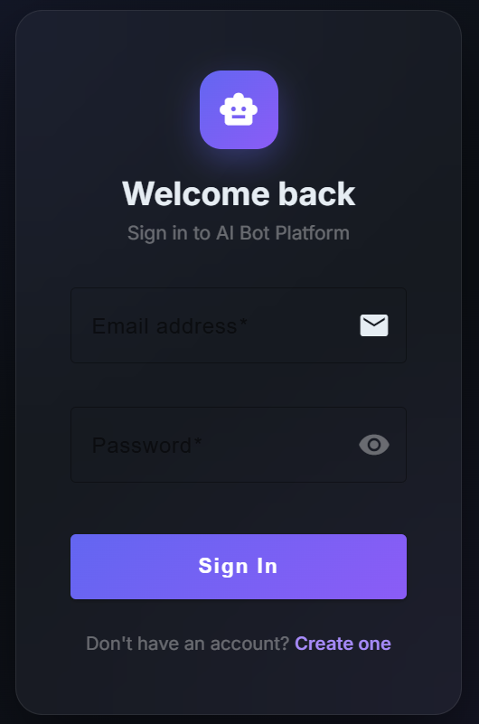
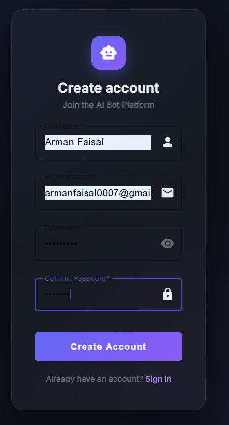
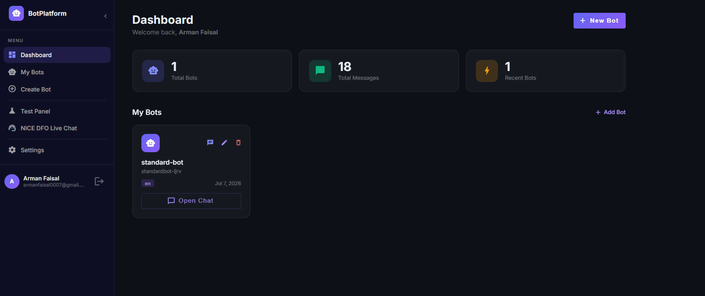
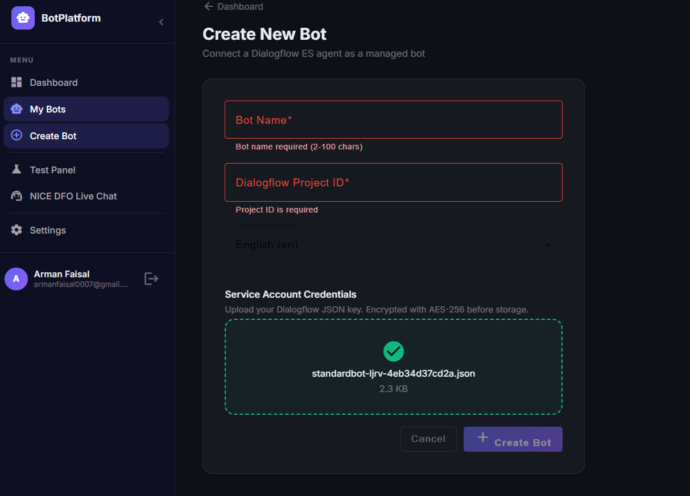
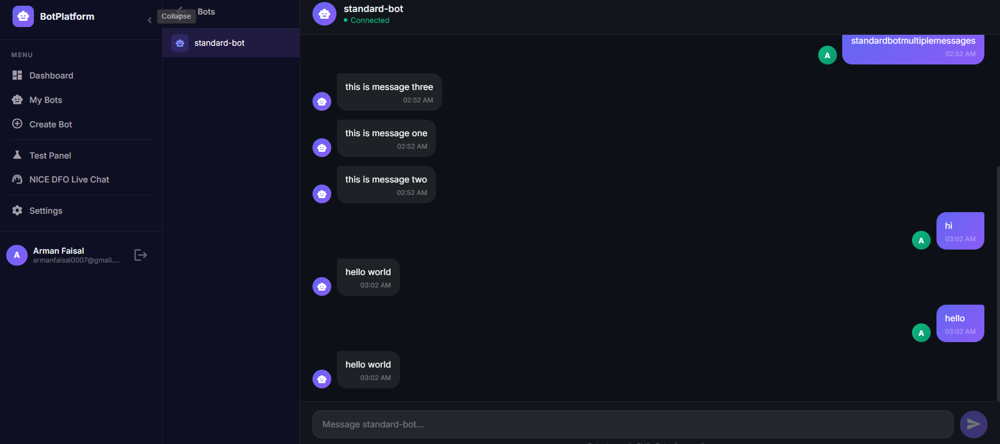
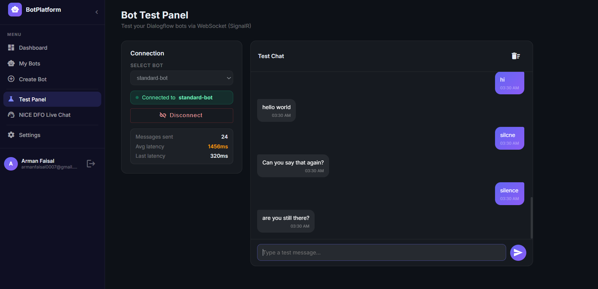
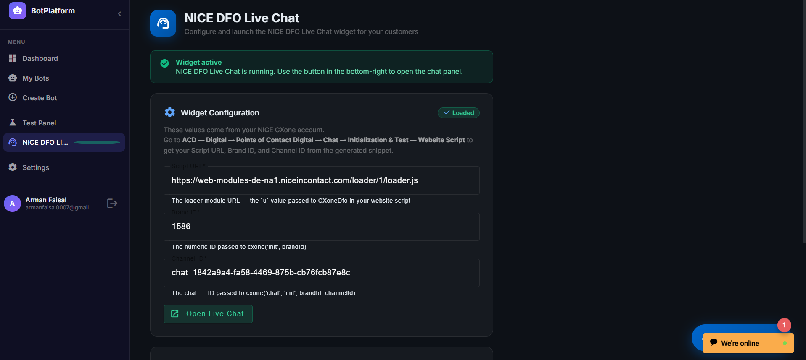

# Bot Management Platform

A full-stack web application for managing Dialogflow-powered chatbots. The system allows users to register, create and configure bots, test them through a dedicated test panel, and serve them to end customers via NICE CXone DFO Live Chat.

---

## Project Overview

The AI Bot Management Platform was built to demonstrate the end-to-end workflow of a chatbot administration system — from user authentication through to live customer-facing chat. The application covers bot configuration management, real-time messaging via WebSockets, and integration with two separate chat surfaces: an internal test panel for developers, and the NICE CXone DFO Live Chat widget for end users.

The backend is an ASP.NET Core 8 Web API that handles authentication, bot CRUD operations, and communication with Google Dialogflow ES via gRPC. All Dialogflow service account credentials uploaded by users are encrypted using AES-256 before being stored in MongoDB, so raw credentials are never written to the database. A SignalR hub manages the WebSocket connection between the Angular frontend and the Dialogflow API, allowing real-time message exchange without polling.

The frontend is an Angular 22 single-page application using standalone components, Angular Material for UI, and Angular Signals for reactive state management. It includes a full bot management interface, a ChatGPT-style chat window, a dedicated Bot Test Panel for testing bot responses outside of the DFO channel, and a NICE DFO Live Chat configuration page where the NICE CXone JavaScript widget is injected and managed at runtime.

The project also includes a NICE CXone Studio script that bridges the DFO Live Chat channel with the backend — when a customer sends a message through the DFO widget, the Studio script calls `POST /api/chat/dfo` on the backend, which forwards the message to Dialogflow and returns the bot's reply to be sent back through the live chat channel.

---

## Features

**Authentication**
- User registration and login with BCrypt password hashing
- JWT-based authentication with 24-hour token expiry
- Route guards on both frontend and backend
- Token passed to SignalR via query string for WebSocket authentication
- Rate limiting on auth endpoints (10 requests/minute)

**Bot Management**
- Create bots by uploading a Dialogflow ES service account JSON file
- JSON is validated against the Dialogflow schema before being stored
- Credentials encrypted with AES-256-CBC before database storage
- Full CRUD: list, view, edit, delete bots
- Credential cache invalidated automatically on update or delete

**Real-Time Chat (Bot Test Panel)**
- WebSocket communication via SignalR — no HTTP polling
- Bot session loaded once on connect; bot object cached in memory per connection to avoid per-message database queries
- Dialogflow gRPC client cached as a singleton per bot (avoids 3–10 second channel rebuild on every message)
- Typing indicator, auto-scroll, message timestamps, connection status
- Reconnect support with exponential backoff
- Multiple bot responses (multi-bubble Dialogflow replies) each delivered as separate message events

**NICE DFO Live Chat**
- NICE CXone JavaScript widget loaded and managed at runtime by the Angular `DfoChatService`
- Widget config (Script URL, Channel ID, Brand ID) configurable via environment file or in-app UI
- Floating launcher button with live status indicator in sidebar
- Backend endpoint (`POST /api/chat/dfo`) for NICE Studio script integration
- Widget unloaded on logout to clean up DOM and config

**Dashboard**
- Total bot count, total message count, recent bots
- Dashboard stats loaded with `forkJoin` (parallel requests)
- Skeleton loading states while data is fetching

**Security**
- AES-256-CBC encryption for Dialogflow credentials
- JWT with HS256 signing
- User-scoped queries — every repository call includes `userId` so users cannot access each other's data
- Global exception middleware mapping exception types to correct HTTP status codes
- Fixed-window rate limiting per endpoint
- File upload validation: extension check, 1MB size limit, Dialogflow JSON schema validation

**Testing**
- Backend: xUnit with Moq, 81 tests across services, controllers, middleware, and DTO validation (~70% estimated coverage)
- Frontend: Vitest with Angular TestBed, tests for all components, services, guards, and interceptors

---

## Project Architecture

```
┌─────────────────────────────────────────────────────────────┐
│                        FRONTEND (Angular 22)                │
│  ┌──────────┐  ┌─────────────┐  ┌──────────┐  ┌─────────┐ │
│  │  Auth    │  │  Bot Mgmt   │  │   Chat   │  │ DFO     │ │
│  │  Pages   │  │  (CRUD)     │  │  Panel   │  │ Widget  │ │
│  └────┬─────┘  └──────┬──────┘  └────┬─────┘  └────┬────┘ │
│       │         HTTPS  │         WebSocket│          │JS    │
└───────┼────────────────┼──────────────┼─────────────┼──────┘
        │                │              │             │
┌───────▼────────────────▼──────────────▼─────────────▼──────┐
│                    BACKEND (ASP.NET Core 8)                 │
│  ┌──────────┐  ┌─────────────┐  ┌──────────┐  ┌─────────┐ │
│  │  Auth    │  │  Bots API   │  │ SignalR  │  │  DFO   │ │
│  │  Service │  │  Service    │  │  ChatHub │  │  Ctrl  │ │
│  └────┬─────┘  └──────┬──────┘  └────┬─────┘  └────┬────┘ │
│       │                │              │              │      │
│  ┌────▼────────────────▼──────────────▼──────────────▼────┐ │
│  │                   MongoDB                               │ │
│  │  Users · Bots (encrypted creds) · ChatHistory          │ │
│  └─────────────────────────────────────────────────────────┘ │
│                              │                              │
│                    ┌─────────▼──────────┐                  │
│                    │  Google Dialogflow  │                  │
│                    │  ES  (gRPC)         │                  │
│                    └────────────────────┘                  │
└────────────────────────────────────────────────────────────┘
              ↑
         NICE CXone Studio calls POST /api/chat/dfo
         when customers use DFO Live Chat widget
```

The backend follows a layered architecture: **Controllers → Services → Repositories → MongoDB**. All layers communicate through interfaces, making the codebase testable with mocks. The `DialogflowClientCache` is a singleton that holds one gRPC `SessionsClient` per bot, built lazily on first use and reused for all subsequent messages. The `MongoDbContext` is also a singleton to share the MongoDB connection pool across all requests.

---

## Tech Stack

| Layer | Technology | Version |
|---|---|---|
| **Frontend Framework** | Angular | 22.0.x |
| **Frontend Language** | TypeScript | ~5.8 |
| **UI Components** | Angular Material | 22.0.x |
| **State Management** | Angular Signals + RxJS | Built-in / 7.8.x |
| **WebSocket Client** | @microsoft/signalr | 8.0.x |
| **Frontend Testing** | Vitest + Angular TestBed | 2.0.x |
| **Backend Framework** | ASP.NET Core | 8.0 (.NET 8) |
| **Backend Language** | C# | 12 |
| **Database** | MongoDB | 8.0.26 |
| **MongoDB Driver** | MongoDB.Driver | 2.27.0 |
| **Authentication** | JWT Bearer (HS256) | 8.0.0 |
| **Password Hashing** | BCrypt.Net-Next | 4.0.3 |
| **Credential Encryption** | AES-256-CBC (System.Security.Cryptography) | Built-in |
| **Bot AI** | Google Dialogflow ES (gRPC) | 4.9.0 |
| **Real-Time** | ASP.NET Core SignalR | Built-in |
| **API Documentation** | Swagger / Swashbuckle | 6.5.0 |
| **Backend Testing** | xUnit + Moq | Latest |
| **Live Chat** | NICE CXone DFO Live Chat (JS widget) | Tenant-hosted |

---

## Folder Structure

```
BOT-MANAGEMENT-PLATFORM/
│
├── backend/
│   ├── AiBotPlatform/
│   │   ├── Configuration/
│   │   │   └── AppSettings.cs            # Strongly-typed settings classes
│   │   ├── Controllers/
│   │   │   ├── AuthController.cs         # POST /api/auth/register|login
│   │   │   ├── BotsController.cs         # CRUD /api/bots
│   │   │   ├── ChatController.cs         # GET  /api/chat/{botId}/history
│   │   │   ├── DashboardController.cs    # GET  /api/dashboard/stats
│   │   │   └── DfoController.cs          # POST /api/chat/dfo (NICE Studio)
│   │   ├── DTOs/
│   │   │   └── Dtos.cs                   # All request/response DTOs
│   │   ├── Helpers/
│   │   │   └── JwtHelper.cs              # Token generation and validation
│   │   ├── Interfaces/
│   │   │   ├── IRepositories.cs
│   │   │   └── IServices.cs
│   │   ├── Middleware/
│   │   │   └── GlobalExceptionMiddleware.cs
│   │   ├── Models/
│   │   │   └── MongoModels.cs            # User, Bot, ChatMessage
│   │   ├── Mongo/
│   │   │   └── MongoDbContext.cs         # Singleton context + index creation
│   │   ├── Repositories/
│   │   │   └── Repositories.cs           # User, Bot, Chat repositories
│   │   ├── Services/
│   │   │   ├── AuthService.cs
│   │   │   ├── BotService.cs
│   │   │   ├── ChatService.cs
│   │   │   ├── DashboardService.cs
│   │   │   ├── DialogflowClientCache.cs  # Singleton gRPC client cache
│   │   │   └── EncryptionService.cs      # AES-256-CBC
│   │   ├── SignalR/
│   │   │   └── ChatHub.cs                # WebSocket hub
│   │   ├── appsettings.json
│   │   └── Program.cs
│   │
│   └── AiBotPlatform.Tests/
│       ├── Controllers/                  # Controller tests
│       ├── Helpers/
│       │   └── TestFixtures.cs           # Shared test builders
│       ├── Middleware/
│       ├── Services/                     # Service + encryption + JWT tests
│       └── Validation/                   # DTO annotation tests
│
├── frontend/
│   ├── src/
│   │   ├── app/
│   │   │   ├── components/
│   │   │   │   └── sidebar/              # Collapsible sidebar with DFO indicator
│   │   │   ├── guards/
│   │   │   │   ├── auth.guard.ts         # Redirect to /login if unauthenticated
│   │   │   │   └── guest.guard.ts        # Redirect to /dashboard if authenticated
│   │   │   ├── interceptors/
│   │   │   │   ├── auth.interceptor.ts   # Attaches Bearer token to all HTTP requests
│   │   │   │   └── error.interceptor.ts  # Handles 401/403 globally
│   │   │   ├── layouts/
│   │   │   │   ├── auth-layout/          # Centered layout for login/register
│   │   │   │   └── main-layout/          # Sidebar + router-outlet
│   │   │   ├── models/
│   │   │   │   └── models.ts             # TypeScript interfaces
│   │   │   ├── pages/
│   │   │   │   ├── auth/                 # Login, Register
│   │   │   │   ├── bots/                 # List, Create, Edit
│   │   │   │   ├── chat/                 # Real-time chat window
│   │   │   │   ├── dashboard/            # Stats + bot grid
│   │   │   │   ├── dfo-chat/             # NICE DFO Live Chat panel
│   │   │   │   ├── error/                # 404, 403 pages
│   │   │   │   ├── settings/             # Account info, DFO config
│   │   │   │   └── test-panel/           # Bot test interface with latency stats
│   │   │   ├── services/
│   │   │   │   ├── auth.service.ts
│   │   │   │   ├── bot.service.ts
│   │   │   │   ├── chat-signalr.service.ts
│   │   │   │   ├── dashboard.service.ts
│   │   │   │   ├── dfo-chat.service.ts   # NICE widget lifecycle manager
│   │   │   │   ├── global-error-handler.service.ts
│   │   │   │   └── notification.service.ts
│   │   │   ├── app.config.ts
│   │   │   └── app.routes.ts             # Lazy-loaded routes
│   │   ├── environments/
│   │   │   ├── environment.ts
│   │   │   └── environment.production.ts
│   │   └── styles/
│   │       └── main.css                  # CSS custom properties, global utilities
│   ├── angular.json
│   ├── package.json
│   └── vitest.config.ts
│
└── studio-scripts/
    └── DFO_Bot_Script.snippet            # NICE CXone Studio script template
```

---

## Installation & Setup

### Prerequisites

| Requirement | Version |
|---|---|
| .NET SDK | 8.0 or above |
| Node.js | 20 LTS or above |
| Angular CLI | `npm install -g @angular/cli@22` |
| MongoDB | 7.0+ (local or Atlas) |
| Google Cloud account | For Dialogflow ES |
| NICE CXone account | For DFO Live Chat (optional for core features) |

---

### Clone Repository

```bash
git clone https://github.com/Arman-dev123/BOT-MANAGEMENT--PLATFORM.git
cd BOT-MANAGEMENT--PLATFORM
```

---

### Backend Setup

```bash
cd backend/AiBotPlatform
dotnet restore
```

**Configure `appsettings.json`:**

```json
{
  "MongoDB": {
    "ConnectionString": "mongodb://localhost:27017",
    "DatabaseName": "AiBotPlatform"
  },
  "JwtSettings": {
    "SecretKey": "your-secret-key-minimum-32-characters-long",
    "Issuer": "AiBotPlatform",
    "Audience": "AiBotPlatformUsers",
    "ExpirationHours": 24
  },
  "EncryptionSettings": {
    "Key": "32-character-encryption-key-here",
    "IV": "16-char-iv-value"
  },
  "Cors": {
    "AllowedOrigins": ["http://localhost:4200"]
  },
  "RateLimiting": {
    "PermitLimit": 100,
    "WindowSeconds": 60
  }
}
```

> **Note:** The `EncryptionSettings.Key` must be exactly 32 characters and `IV` must be exactly 16 characters. These are used for AES-256-CBC encryption of Dialogflow service account files.

**Run the backend:**

```bash
dotnet run
# Listening on: http://localhost:5000
```

**Swagger UI:** `http://localhost:5000/swagger`

---

### Frontend Setup

```bash
cd frontend
npm install
```

**Configure `src/environments/environment.ts`:**

```typescript
export const environment = {
  production: false,
  apiUrl: 'http://localhost:5000/api',
  hubUrl: 'http://localhost:5000',
  dfoChat: {
    scriptUrl: '',    // From NICE CXone: ACD → Digital → POC Digital → Chat → Website Script
    channelId: '',    // niceDFOConfig.channelId from the widget script
    brandId: ''       // niceDFOConfig.brandId from the widget script
  }
};
```

**Run the dev server:**

```bash
ng serve
# Available at: http://localhost:4200
```

---

### MongoDB Setup

MongoDB creates the `AiBotPlatform` database and all collections automatically on first run. The `MongoDbContext` also creates the following indexes on startup:

- `Users.email` — unique index
- `Bots.userId` — for user-scoped queries
- `ChatHistory` compound index on `(userId, botId, timestamp DESC)`

No manual collection setup is required.

---

### Google Dialogflow Setup

1. Go to [Google Cloud Console](https://console.cloud.google.com) and create a project
2. Enable the **Dialogflow API** under APIs & Services
3. Go to **IAM & Admin → Service Accounts** → Create a service account with the **Dialogflow API Client** role
4. Under the service account → **Keys** tab → **Add Key → JSON** → download the file
5. Use this JSON file when creating a bot in the application

---

### Build for Production

```bash
# Frontend
cd frontend
ng build --configuration production
# Output: dist/ai-bot-platform/

# Backend
cd backend/AiBotPlatform
dotnet publish -c Release -o ./publish
```

---

## API Endpoints

### Authentication (`/api/auth`) — Rate limited: 10 req/min

| Method | Endpoint | Auth | Description |
|--------|----------|------|-------------|
| `POST` | `/api/auth/register` | None | Register a new user account |
| `POST` | `/api/auth/login` | None | Login and receive JWT token |

### Bots (`/api/bots`) — JWT required

| Method | Endpoint | Auth | Description |
|--------|----------|------|-------------|
| `GET` | `/api/bots` | Bearer | List all bots for the authenticated user |
| `POST` | `/api/bots/create` | Bearer | Create a bot (multipart: form fields + JSON credential file) |
| `GET` | `/api/bots/{id}` | Bearer | Get a specific bot by ID |
| `GET` | `/api/bots/{id}/config` | Bearer | Get bot config including credential status |
| `PUT` | `/api/bots/{id}` | Bearer | Update bot name or language code |
| `DELETE` | `/api/bots/{id}` | Bearer | Delete a bot (also invalidates Dialogflow client cache) |

### Chat (`/api/chat`) — JWT required

| Method | Endpoint | Auth | Description |
|--------|----------|------|-------------|
| `GET` | `/api/chat/{botId}/history` | Bearer | Retrieve chat history for a bot (max 200 messages) |

### Dashboard (`/api/dashboard`) — JWT required

| Method | Endpoint | Auth | Description |
|--------|----------|------|-------------|
| `GET` | `/api/dashboard/stats` | Bearer | Total bots, total messages, recent bots list |

### DFO Live Chat (`/api/chat/dfo`) — No auth (called by NICE Studio)

| Method | Endpoint | Auth | Description |
|--------|----------|------|-------------|
| `POST` | `/api/chat/dfo` | None | Receives message from NICE CXone Studio, returns Dialogflow reply |

### SignalR Hub (`/hubs/chat`) — JWT via query string

| Method | Direction | Description |
|--------|-----------|-------------|
| `ConnectBot(botId)` | Client → Server | Load bot, warm up Dialogflow client, return chat history |
| `SendMessage(message)` | Client → Server | Send message to Dialogflow, return bot response(s) |
| `DisconnectBot()` | Client → Server | End the current bot session |
| `BotConnected(botId, history)` | Server → Client | Fired after ConnectBot succeeds |
| `MessageReceived(msg)` | Server → Client | New message (user echo or bot reply) |
| `BotTyping(bool)` | Server → Client | Typing indicator state |
| `BotDisconnected` | Server → Client | Session ended |
| `Error(message)` | Server → Client | Error from server |

---

## Screenshots

<table>
  <tr>
    <th>Screen</th>
    <th>Preview</th>
  </tr>
  <tr>
    <td>Login</td>
    <td></td>
  </tr>
  <tr>
    <td>Register</td>
    <td></td>
  </tr>
  <tr>
    <td>Dashboard</td>
    <td></td>
  </tr>
  <tr>
    <td>Create Bot</td>
    <td></td>
  </tr>
  <tr>
    <td>Chat</td>
    <td></td>
  </tr>
  <tr>
    <td>Test Panel</td>
    <td></td>
  </tr>
  <tr>
    <td>DFO Chat</td>
    <td></td>
  </tr>
</table>

---

## Running Tests

### Backend (xUnit)

```bash
cd backend/AiBotPlatform.Tests
dotnet test
```

With coverage:

```bash
dotnet test /p:CollectCoverage=true /p:CoverletOutputFormat=opencover
```

**Test files:**

| File | Tests |
|------|-------|
| `AuthServiceTests.cs` | 7 — register, login, hashing, email case |
| `BotServiceTests.cs` | 13 — CRUD, file validation, cache invalidation |
| `ChatServiceTests.cs` | 7 — history, warmup, Dialogflow error paths |
| `EncryptionAndJwtTests.cs` | 11 — encrypt/decrypt round-trips, token claims |
| `DashboardServiceTests.cs` | 4 — stats aggregation, parallel queries |
| `ControllersTests.cs` | 11 — auth, bots, dashboard controller responses |
| `DfoControllerTests.cs` | 7 — DFO endpoint paths and error handling |
| `GlobalExceptionMiddlewareTests.cs` | 7 — all exception → HTTP status mappings |
| `DtoValidationTests.cs` | 14 — DataAnnotation validation on all DTOs |

### Frontend (Vitest)

```bash
cd frontend
npm test                 # Single run
npm run test:watch       # Watch mode
npm run test:coverage    # With coverage report (output: coverage/index.html)
```

---

## Future Improvements

- **Docker Compose** — Single-command startup for backend, frontend, and MongoDB together (partially planned in training task)
- **Refresh tokens** — Currently tokens expire after 24 hours with no refresh mechanism; adding a refresh token flow would improve session handling
- **Bot analytics** — Message volume charts, average response latency per bot over time
- **Credential rotation** — Allow re-uploading credentials for an existing bot without deleting and recreating it
- **Multi-language support** — The language code is stored but the UI only offers a fixed list; could be extended to accept any BCP-47 code
- **NICE Studio script automation** — Currently the Studio script requires manual configuration; a future version could use the CXone API to deploy scripts programmatically
- **WebSocket reconnection state** — On reconnect, the current implementation starts a fresh session; restoring in-flight message state would improve resilience

---

## Troubleshooting

**`dotnet run` shows `http://localhost:5000` but Swagger is blank**
> Make sure you are in the `backend/AiBotPlatform` directory, not the solution root. The Swagger UI is available at `http://localhost:5000/swagger` only in Development mode.

**`ng serve` fails with `Cannot determine project or target`**
> You need `tsconfig.spec.json` and `karma.conf.js` (or `vitest.config.ts`) in the frontend root. Check that `angular.json` exists in the same directory as `package.json`. Run `ng serve` from the `frontend/` folder.

**MongoDB connection refused**
> Start MongoDB: `net start MongoDB` (Windows) or `brew services start mongodb-community` (macOS). The application does not start the MongoDB service itself.

**Dialogflow returns 403 on first message**
> The service account JSON may not have the **Dialogflow API Client** role assigned. Check in GCP → IAM & Admin → Service Accounts.

**First message takes 5–10 seconds**
> This is the one-time gRPC channel build for a new bot. Subsequent messages use the cached `SessionsClient` and should respond in under 500ms. The channel is also pre-warmed when you open the chat window via `ConnectBot`.

**NICE DFO widget does not appear after clicking "Load Widget"**
> Check that the Script URL, Channel ID, and Brand ID exactly match the values in your NICE CXone tenant under: `ACD → Digital → Points of Contact Digital → Chat → [channel] → Initialization & Test → Website Script`. The browser console will show a script load error if the URL is incorrect.

**CORS error in browser**
> Confirm `appsettings.json → Cors.AllowedOrigins` includes `http://localhost:4200`. Restart the backend after any config change.

**`EncryptionSettings.Key must be 32 characters` error on startup**
> The AES key must be exactly 32 UTF-8 characters and the IV must be exactly 16. Pad or trim your values accordingly in `appsettings.json`.

---

## Conclusion

This project covers the full stack of the training task: JWT-secured REST APIs, real-time WebSocket messaging via SignalR, AES-encrypted credential storage, Dialogflow ES integration with a cached gRPC client, unit test coverage above 50% on both frontend and backend, and integration with NICE CXone DFO Live Chat through both a JavaScript widget and a Studio script backend endpoint. The codebase follows standard industry patterns including Repository, Service Layer, Dependency Injection, and Singleton, as outlined in the task requirements. It is ready for code review via the linked repository.

---

> **Repository:** [https://github.com/Arman-dev123/BOT-MANAGEMENT--PLATFORM](https://github.com/Arman-dev123/BOT-MANAGEMENT--PLATFORM)
> **Training Programme:** InteractCX — Full Stack Bot Management Platform
> **Stack:** Angular 22 · ASP.NET Core 8 · MongoDB · Google Dialogflow ES · NICE CXone DFO
